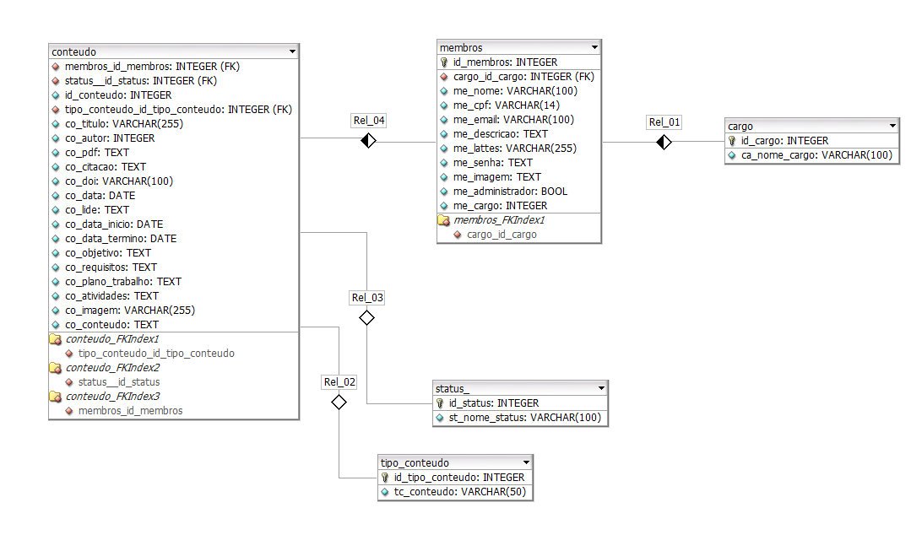

# ABP 1º Semestre DSM

# Desenvolvimento de um website para o laboratório de Sensoriamento Remoto Agrícola do INPE – AgriRS Lab


<p align="center">
      
      <h2 align="center"> NightHawks</h2>
</p>


<p align="center">
  | <a href ="#desafio"> Desafio</a>  |
  <a href ="#solucao"> Solução</a>  |
<a href="#requisitos">Requisitos</a> |
  <a href ="#backlog"> Backlog do Produto</a>  |
  <a href ="#dor">DoR</a>  |
  <a href ="#dod">DoD</a>  |
  <a href ="#tasks"> Tasks</a> |
<a href ="#tecnologias">Tecnologias</a> |
  <a href ="#manual">Manual de Instalação</a>  | 
  <a href ="#equipe"> Equipe</a> |
  <a href ="#usuario"> Manual do Usuário</a> |
      <a href ="#user-stories"> User Stories</a>
</p>

> Status do Projeto: Início 15/09/2025   
>
>[Pasta de Documentação](./docs) 📄
> 
> <p>[1- Vídeo do Projeto no YouTube](https://www.youtube.com/watch?v=bLmCPFcv2Is) 📽️</p>
> <p>[2- Vídeo do Projeto no YouTube](https://www.youtube.com/watch?v=tCPADslzZis)📽️</p>
><p>[3- Vídeo do Projeto no YouTube](https://www.youtube.com/watch?v=5xIeT06M3OU)📽️</p> 


##  Desafio <a id="desafio"></a>

A criação de um website para o Laboratório de Sensoriamento Remoto Agrícola do INPE (AgriRS
Lab) tem como propósito principal centralizar as informações importantes do laboratório, ampliar
a visibilidade do laboratório e facilitar o acesso do público às pesquisas, projetos e iniciativas. Além
disso, seria importante para divulgar informações importantes, como os integrantes da equipe,
nossas áreas de atuação, publicações científicas, oportunidades de trabalho e formas de contato.
Isso ajudaria a manter nossas atividades e descobertas científicas atualizadas para a comunidade e
promoveria a divulgação do laboratório para quem quiser conhecer ou se aproximar do nosso
trabalho.

##  Solução <a id="solucao"></a>

Criar um website institucional para o AgriRS Lab, do INPE, tem como principal objetivo centralizar e organizar as informações do laboratório, facilitando o acesso do público às pesquisas, projetos e atividades desenvolvidas. A plataforma digital servirá como um canal de comunicação direta com a comunidade científica, estudantes, instituições parceiras e o público interessado.
As soluções esperadas incluem o desenvolvimento de um site moderno, responsivo, de fácil navegação e com estrutura administrativa simples, que permita atualizações frequentes pela própria equipe. A integração com redes sociais e plataformas acadêmicas, bem como a adoção de boas práticas de acessibilidade, também são pontos fundamentais para ampliar o alcance e a inclusão.

---
##  Requisitos <a id="requisitos"></a>

<h4>🧩Funcionais</h4>

| Código   | Descrição                                                                                                   |
| -------- | ----------------------------------------------------------------------------------------------------------- |
| **RF01** | **Página Inicial (Início/Home)**                                                                            |
| RF01.1   | Apresentar botões/menus de navegação para todas as páginas do site.                                         |
| RF01.2   | Exibir seções em destaque (cards) com chamadas para notícias, projetos, publicações ou outras atualizações. |
| RF01.3   | Link para redes sociais e contato no final da página.                                                       |
| RF01.4   | Incluir colaboradores e financiadores (CNPq, CAPES, FAPESP).                                                |
| **RF02** | **Página sobre o AgriRS (Sobre o AgriRS/About AgriRS)**                                                     |
| RF02.1   | Descrever o laboratório, objetivo e foco.                                                                   |
| RF02.2   | Descrever as áreas de atuação com pequenos textos explicativos.                                             |
| **RF03** | **Página de Membros (Equipe/Team)**                                                                         |
| RF03.1   | Listar todos os integrantes com nome, foto, função e breve descrição.                                       |
| RF03.2   | Categorizar por tipo de membro (titulares, colaboradores, bolsistas, doutorado, mestrado, ex-membros).      |
| RF03.3   | Ordenar cada categoria por ordem alfabética.                                                                |
| **RF04** | **Página de Vagas (Oportunidades/Join Us)**                                                                 |
| RF04.1   | Listar oportunidades como estágios, IC, pós-graduação e parcerias.                                          |
| RF04.2   | Informar como se candidatar (documentos, critérios, prazos etc.).                                           |
| **RF05** | **Página de Projetos (Projetos/Projects)**                                                                  |
| RF05.1   | Listar projetos com título, resumo, ano de início, status e equipe envolvida.                               |
| RF05.2   | Permitir a inclusão de imagens ou links para mais informações.                                              |
| **RF06** | **Página de Notícias (Notícias/News)**                                                                      |
| RF06.1   | Permitir a publicação de notícias com título, data, imagem e texto.                                         |
| RF06.2   | Organizar as notícias cronologicamente.                                                                     |
| **RF07** | **Página de Publicações (Publicações/Publications)**                                                        |
| RF07.1   | Listar artigos, livros, capítulos etc., com título, revista, autores, ano e link.                           |
| RF07.2   | Campo de pesquisa por palavra-chave.                                                                        |
| **RF08** | **Página de Contato (Contato/Contact)**                                                                     |
| RF08.1   | Formulário com nome, e-mail, assunto e mensagem que redireciona para o e-mail institucional.                |
| RF08.2   | Exibir informações institucionais como telefone, e-mail e endereço.                                         |
| RF08.3   | Incluir links para as redes sociais do laboratório.                                                         |
| RF08.4   | Incluir mapa com a localização do laboratório dentro do INPE.                                               |

<h4>⚙️ Não Funcionais</h4>

| Código    | Descrição                                                                  |
| --------- | -------------------------------------------------------------------------- |
| **RNF01** | O site deve ser totalmente responsivo (celulares, tablets e computadores). |
| **RNF02** | O conteúdo deve ser fácil de atualizar por integrantes do laboratório.     |
| **RNF03** | O site deve carregar rapidamente (imagens otimizadas).                     |
| **RNF04** | Ter versões em português e inglês.                                         |
| **RNF05** | Utilizar hospedagem confiável e domínio próprio.                           |
| **RNF06** | Seguir a identidade visual definida com os integrantes do laboratório.     |


##  User Stories <a id="user-stories"></a>

### 👤📝 User Stories – Sistema AgriRS

A tabela abaixo relaciona cada requisito funcional e não funcional com sua respectiva User Story para facilitar o rastreamento e desenvolvimento.

### 📋 Tabela de User Stories

| Requisito | User Story |
|-----------|------------|
| **RF01.1** | Como visitante, eu quero visualizar menus e botões de navegação, para acessar facilmente qualquer página. |
| **RF01.2** | Como visitante, eu quero ver cards com destaques, para acessar rapidamente conteúdos importantes. |
| **RF01.3** | Como visitante, eu quero encontrar links de contato e redes sociais no rodapé, para poder seguir ou entrar em contato. |
| **RF01.4** | Como visitante, eu quero visualizar financiadores e colaboradores, para entender quem apoia o laboratório. |
| **RF02.1** | Como visitante, eu quero acessar informações sobre o laboratório, para entender seu propósito e foco. |
| **RF02.2** | Como visitante, eu quero ver descrições das áreas de atuação, para compreender os temas trabalhados. |
| **RF03.1** | Como visitante, eu quero ver a lista de membros com foto e descrição, para conhecer a equipe do laboratório. |
| **RF03.2** | Como visitante, eu quero visualizar os membros separados por categoria, para facilitar a navegação entre grupos. |
| **RF03.3** | Como visitante, eu quero ver membros organizados alfabeticamente, para localizar pessoas rapidamente. |
| **RF04.1** | Como candidato, eu quero visualizar as vagas e oportunidades, para saber se posso me candidatar. |
| **RF04.2** | Como candidato, eu quero saber como me candidatar (documentos, requisitos, prazos), para realizar a inscrição corretamente. |
| **RF05.1** | Como visitante, eu quero ver a lista de projetos com informações completas, para entender o que o laboratório desenvolve. |
| **RF05.2** | Como visitante, eu quero acessar imagens e links adicionais dos projetos, para obter mais detalhes. |
| **RF06.1** | Como visitante, eu quero acessar notícias com título, imagem, data e texto, para acompanhar atualizações. |
| **RF06.2** | Como visitante, eu quero ver notícias organizadas cronologicamente, para identificar facilmente as mais recentes. |
| **RF07.1** | Como visitante, eu quero ver publicações científicas com informações completas, para consultar trabalhos do grupo. |
| **RF07.2** | Como visitante, eu quero pesquisar publicações por palavra-chave, para encontrar materiais específicos. |
| **RF08.1** | Como visitante, eu quero enviar uma mensagem pelo formulário de contato, para tirar dúvidas ou solicitar informações. |
| **RF08.2** | Como visitante, eu quero ver telefone, e-mail e endereço institucional, para acessar outros canais de contato. |
| **RF08.3** | Como visitante, eu quero acessar links das redes sociais também na página de contato, para conectar-me facilmente ao laboratório. |
| **RF08.4** | Como visitante, eu quero visualizar o mapa do laboratório dentro do INPE, para encontrá-lo fisicamente. |
| **RNF01** | Como usuário de qualquer dispositivo, eu quero que o site seja responsivo, para navegar sem dificuldades. |
| **RNF02** | Como membro do laboratório, eu quero atualizar conteúdos do site facilmente, para manter as informações atualizadas. |
| **RNF03** | Como visitante, eu quero que o site carregue rapidamente, para ter uma navegação fluida. |
| **RNF04** | Como visitante internacional, eu quero acessar versões em português e inglês, para entender o conteúdo no meu idioma. |
| **RNF05** | Como visitante, eu quero acessar o site sem quedas ou instabilidades, para ter uma navegação confiável. |
| **RNF06** | Como visitante, eu quero que o site siga a identidade visual do laboratório, para ter uma experiência consistente. |


## 🔄 Modelo entidade relação para criação do Banco de Dados <a id="#"></a>
<p align="center">
  
</p>

> Arquivo.xml para DB Design 4
>
> [Arquivo.xml](docs\entidade-relacao-AgriRSLab_NightHawks.xml) 
------------

## 💡 Casos de Uso <a id="backlog"></a>

> [Arquivo caso de uso ⚙️](docs/casodeuso_1_0_uml.asta)
>

---
## 📋 Backlog do Produto <a id="backlog"></a>


<h4>Sprints</h4>

| Sprint | Ojetivos        | Documentação | Período| Status  | 
|--------|-----------------|------|--------|---------- | 
| 1      | HTML/Figma      | [Sprint 1 Docs](./docs/sprint1/readme.md)     |    15/09/25 - 03/10/25    |   ✔ Concluído    | 
| 2      | Backend/Banco de Dados        |  [Sprint 2 Docs](./docs/sprint2/README.md)     |   13/10/25 - 31/10/25     |  ✔ Concluído         | 
| 3      | Backend/Ajustes |  [Sprint 3 Docs](./docs/sprint3/README.md)    |     06/11/25 - 24/11/25   |   ✔ Concluído        | 


## 📝 Tasks <a id="tasks"></a>
<h4>TASKS por Sprint<h4> 


> [Sprint 1 Tasks](./docs/sprint1/tasks.md)
>
> [Sprint 2 Tasks](./docs/sprint2/tasks.md)   
> 
> [Sprint 3 Tasks](./docs/sprint3/tasks.md)   

---


## ‍ DoR - Definition of Ready <a id="dor"></a>

* Design no **Figma**
* Backlog do produto **a partir das RFNS**
* Divisão de Tasks por integrantes
  

##  DoD - Definition of Done <a id="dod"></a>

* Código completo (HTML/CSS/Backend)
* Vídeos de cada etapa de entrega
* Manual da Aplicação
* Documentação da ABP e Manual do Usuário
  
---

## 💻 Tecnologias <a id="tecnologias"></a>

<h4 align="center">
<a href="https://developer.mozilla.org/pt-BR/docs/Web/HTML"></a>
<a href="https://developer.mozilla.org/pt-BR/docs/Web/HTML"></a>
 <a href="https://www.typescriptlang.org/"></a>
 <a href="https://github.com/"></a>
 <a href="https://www.figma.com/"></a>
      <a href="https://www.microsoft.com/pt-br/windows">
  
</a>
<a href="https://code.visualstudio.com/">
  
</a>
<a href="https://developer.mozilla.org/pt-BR/docs/Web/JavaScript">
  
</a>
<a href="https://trello.com/">
  
</a>
<a href="https://astah.net/">
  
</a>
<a href="https://www.microsoft.com/pt-br/microsoft-365/excel">
  
</a>
      <a href="https://git-scm.com/">
  
</a>
</h4>

## 📖 Manual de Instalação <a id="manual"></a>

## 🛠️ Guia de Instalação e Execução Local do Projeto

Este guia detalha os softwares necessários e o processo passo a passo para colocar o projeto *ABP-1* para rodar em sua máquina.

### 1\. Pré-requisitos e Instalação de Softwares Essenciais

Estes são os softwares básicos que devem ser instalados **antes** de iniciar o processo de configuração do projeto.

| Software | Função Principal | Link para Download |
| :--- | :--- | :--- |
| **Git** | Sistema de controle de versão, essencial para **clonar** seu projeto do GitHub. | https://git-scm.com/install |
| **Node.js** | Ambiente de tempo de execução (runtime) e gerenciador de pacotes (**npm**). Necessário para rodar o Back-end e gerenciar dependências do Front-end. | https://nodejs.org/en/download |
| **Visual Studio Code** (ou IDE de sua preferência) | Editor de código recomendado para abrir, visualizar e editar os arquivos do projeto. | https://code.visualstudio.com/download |
| **PostgreSQL** | Software de Banco de Dados. Seu back-end utiliza o **PostgreSQL** para armazenar dados. | https://www.postgresql.org/download |

**Atenção:** Ao instalar o **PostgreSQL**, certifique-se de anotar a **senha** que você definir para o usuário principal (geralmente `postgres`), pois ela será necessária para o próximo passo.

* * *

### 2\. 🚀 Passo a Passo para Inicializar o Projeto

Com os pré-requisitos instalados, siga a ordem abaixo para configurar e rodar o projeto.

#### Passo A: Clonar o Repositório

1.  Acesse seu repositório no GitHub.
    
2.  Clique no botão verde "**Code**" e copie a URL HTTPS.
    
3.  Abra seu **terminal** (ou Git Bash no Windows).
    
4.  Navegue até o diretório onde você quer salvar o projeto (ex: `cd ~/Documents/Projetos`).
    
5.  Execute o comando para clonar o projeto:
    
    ```bash
    git clone https://github.com/NightHawksDevelopers/ABP-1.git
    ```
    
6.  Entre no diretório do projeto clonado:
    
    ```bash
    cd ABP-1
    ```
    

* * *

#### Passo B: Configurar e Rodar o Back-end

O Back-end deve ser iniciado primeiro para que o Front-end possa se conectar a ele.

1.  Acesse a pasta do seu back-end (o nome da pasta pode ser `backend`, `server`, etc., **verifique o nome correto no seu repositório**):
    
    ```bash
    cd backend 
    ```
    
2.  Instale todas as dependências do back-end (via `npm` ou `yarn`):
    
    ```bash
    npm install 
    # ou yarn install
    ```
    
3. Criar o banco de dados  Pgadmin  de nome agrirslab.    

&nbsp;

1.  Configuração de Variáveis de Ambiente (.env):
    
    - Necessário  o arquivo de variáveis chamado **`.env`** na raiz da pasta do Back-end ou solicite o arquivo completo pelo link : https://drive.google.com/file/d/1ANMgHxlR_KjsYb5zz4K_CgzHcm18V5uJ/view?usp=sharing
    - **Copie o conteúdo** do arquivo de exemplo de variáveis de ambiente do projeto (geralmente chamado `.env.example` ou `env.development`) para dentro do seu novo arquivo `.env`.
    - **Edite** as variáveis de conexão com o PostgreSQL. Você precisará do **usuário** (geralmente `postgres`), **senha** (que você definiu na instalação) e o **nome do banco de dados** que você deseja criar.
    
    > *Exemplo de variáveis a serem preenchidas:* `DB_HOST`, `DB_USER`, `DB_PASSWORD`, `DB_NAME`.
    
2.  Execute o comando  para ativar a criptografia ( acessando de dentro da pasta backend):
    
    `node src/db/criptografar-senhas.js`
    
    &nbsp;
    
3.  **Rodar o Servidor:** Inicie o servidor back-end:
    
    ```bash
    npm run dev 
    # ou npm start (use o comando correto definido no seu package.json)
    ```
    
    O terminal deve indicar em qual porta o servidor está rodando (ex: `Servidor rodando em http://localhost:3000`). **Mantenha este terminal aberto.**
    

* * *

#### Passo C: Configurar e Rodar o Front-end

1.  Abra um **novo terminal** (mantendo o terminal do Back-end rodando).
    
2.  Acesse a pasta do seu front-end (o nome da pasta pode ser `frontend`, `client`, etc.):
    
    ```bash
    cd ../pages
    ```
    
3.  Instale todas as dependências do front-end:
    
    ```bash
    npm install
    # ou yarn install
    ```
    
4.  **Rodar o Front-end:** Inicie a aplicação front-end:
    
    ```bash
    npm run dev 
    # ou npm start (use o comando correto definido no seu package.json)
    ```
    
    O front-end geralmente abre automaticamente no seu navegador (ex: `http://localhost:5173`). Se não abrir, acesse o endereço indicado no terminal.
    

**Parabéns!** Seu site agora está rodando localmente!

## 📘 Manual de Usuário e Catálogo de Funcionalidades  <a id="usuario"></a>

O Manual de Usuário reúne instruções essenciais para navegar e utilizar o sistema, explicando páginas, recursos e principais ações de forma simples e objetiva para o usuário e administrador.

> [PDF Manual do Usuário 📘](docs/manual_usuario.pdf)


## 🎓 Equipe <a id="equipe"></a>

<div align="center">
  <table>
    <tr>
      <th>Membro</th>
      <th>Função</th>
      <th>Github</th>
      <th>Linkedin</th>
    </tr>
    <tr>
      <td>Gianluca Lourenço</td>
      <td>Product Owner</td>
      <td><a href="https://github.com/Duraxxi"></a></td>
      <td><a href="https://www.linkedin.com/in/joice-aparecida-581226250/"></a></td>
    </tr>
    <tr>
      <td>Victor Coutinho</td>
      <td>Scrum Master</td>
      <td><a href="https://github.com/Vitaixs"></a></td>
      <td><a href=""></a></td>
    </tr>
    <tr>
      <td>Allan Ramos</td>
      <td>Desenvolvedor</td>
      <td><a href="https://github.com/Allan-ramos122"></a></td>
      <td><a href="https://www.linkedin.com/in/isaque-elis-da-silva-2a4087226/"></a></td>
    </tr>
    <tr>
      <td>Guilherme Henrique</td>
      <td>Desenvolvedor</td>
      <td><a href="https://github.com/guioliv3"></a></td>
      <td><a href="www.linkedin.com/in/guilherme-henrique-de-oliveira-97076535b"></a></td>
    </tr>
    <tr>
      <td>Lucas Cobra</td>
      <td>Desenvolvedor</td>
      <td><a href="https://github.com/LucasCobraFatec"></a></td>
      <td><a href=""></a></td>
    </tr>
    <tr>
      <td>Lucas Cecon</td>
      <td>Desenvolvedor</td>
      <td><a href="https://github.com/lucas-cecon"></a></td>
      <td><a href=""></a></td>
    </tr>

  </table>
</div>
