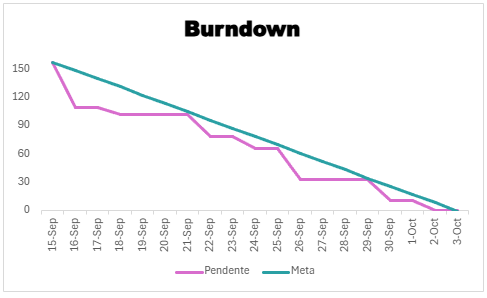

# ABP 1º Semestre DSM

# Documentação - Sprint 1

  <a href ="#desafio"> Desafio</a>  |
  <a href ="#us"> Backlog</a>  |   
  <a href ="#dor">DoR</a>  |
  <a href ="#dod">DoD</a>  |
  <a href ="#equipe"> Equipe</a> |
<a href ="#burndown"> Burndown</a>

> Status da Sprint: Finalizado ✅
>
> [Sprint 1 no YouTube](https://www.youtube.com/watch?v=bLmCPFcv2Is) 📽️

##  Burndown Chart 📉🔥 

  

##  Desafio 

Desenvolver a Home Page responsiva de um site institucional do INPE seguindo um design fornecido. Organização de metodologia de trabalho, pastas, GitHub e padronização. Utilização de FIGMA, HTML, CSS.

##  Backlog e progresso 

  

    
<strong>🏷️ Legendas Tasks</strong>

    <ul>
      <li><strong>DD</strong> — Design Digital</li>
      <li><strong>DW</strong> — Desenvolvimento Web</li>
      <li><strong>ES</strong> — Engenharia de Software</li>
      <li><strong>AL</strong> — Algoritmos e Lógica de Programação</li>
      <li><strong>MB</strong> — Modelagem de Banco de Dados</li>
      <li><strong>SO</strong> — Sistemas Operacionais e Redes</li>
    </ul>
  

  

    
<strong>🏷️ Legendas Backlog ID</strong>

    <ul>
      <li><strong>RF</strong> — Requisito funcional</li>
      <li><strong>RNF</strong> — Requisito não funcional</li>
    </ul>
  

----------------------------------------------------

| Backlog ID | Task                         | Tipo do item           | Descrição                                             | Prioridade | Especifidades                                                                                                                                                                                                                                                                                                    | Pontuação | Status    | Tecnologias utilizadas                                                                                                                        | Prazo    | Atribuídos                                                                        |
|------------|------------------------------|------------------------|-------------------------------------------------------|------------|------------------------------------------------------------------------------------------------------------------------------------------------------------------------------------------------------------------------------------------------------------------------------------------------------------------|-----------|-----------|-----------------------------------------------------------------------------------------------------------------------------------------------|----------|-----------------------------------------------------------------------------------|
| RNF01      | DD-001                       | DESIGN                 | SELEÇÃO DE COR BASE DO SITE                           | Urgente    | Identidade visual com referencias de cor e designer                                                                                                                                                                                                                                                              | 1         | Realizado | ADOBE COLOR, FIGMA                                                                                                                            | 16/09/25 | Lucas Cobra, Victor,                                                              |
| RNF01      | DD-003                       | DESIGN                 | CRIAÇÃO PAGINA BASE                                   | Urgente    | Criar página base com header e footer que serão utilizados como padrão para todas as páginas seguintes                                                                                                                                                                                                           | 3         | Realizado | <a href="https://www.figma.com/proto/9wDsKiqDqGBAP3EbZZZpIE/ABP01---INPE?node-id=42-2&t=VVGvKLjAo0fiwuLC%E2%80%A6" target="_blank">Figma</a>  | 17/09/25 | Allan, Gianluca, Guilherme, Lucas Cecon, Lucas Cobra, Nikolas, Victor, Thiasley,  |
| RNF01      | DW-001,DW-002, DW-009        | FRONTEND               | CRIAÇÃO PAGINA BASE                                   | Urgente    | Criar uma página base com o header e footer que servirá de padrão para todas as páginas seguintes                                                                                                                                                                                                                | 5         | Realizado | VsCODE                                                                                                                                        | 19/09/25 | Guilherme, Victor,                                                                |
| RF01       | DD-004                       | DESIGN                 | CRIAÇÂO DE UMA PAGINA HOME                            | Urgente    | Criar uma página home OBRIGATÓRIAMENTE contendo cards de notícias, projeto, publicações ou outras atualizações, colaboradores, descrições sobre o INPE e o laboratório e previews das demais páginas.                                                                                                            | 5         | Realizado | <a href="https://www.figma.com/proto/9wDsKiqDqGBAP3EbZZZpIE/ABP01---INPE?node-id=42-2&t=VVGvKLjAo0fiwuLC%E2%80%A6" target="_blank">Figma</a>  | 19/09/25 | Lucas Cobra,                                                                      |
| RF03       | DD-005                       | DESIGN                 | CRIAÇÃO DE UMA PÁGINA DE MEMBROS                      | Urgente    | Criar uma página referente aos membros do laboratório, descrevendo tambem as respectivas àreas de atuação, nome, foto, função e breve descrição.                                                                                                                                                                 | 5         | Realizado | <a href="https://www.figma.com/proto/9wDsKiqDqGBAP3EbZZZpIE/ABP01---INPE?node-id=42-2&t=VVGvKLjAo0fiwuLC%E2%80%A6" target="_blank">Figma</a>  | 19/09/25 | Lucas Cecon,                                                                      |
| RF02       | DD-006                       | DESIGN                 | CRIAÇÃO DE UMA PÁGINA "SOBRE"                         | Urgente    | Criar uma página descrevendo com detalhes o laboratório, contendo OBRIGATÓRIAMENTE objetivo, foco, descrição sobre as àreas de atuação e textos explicativos                                                                                                                                                     | 3         | Realizado | <a href="https://www.figma.com/proto/9wDsKiqDqGBAP3EbZZZpIE/ABP01---INPE?node-id=42-2&t=VVGvKLjAo0fiwuLC%E2%80%A6" target="_blank">Figma</a>  | 19/09/25 | Gianluca,                                                                         |
| RF04       | DD-007                       | DESIGN                 | CRIAÇÃO DE UMA PÁGINA DE VAGAS                        | Urgente    | Criar uma página de vagas contendo instruções sobre como se candidatar, oportunidades e parcerias estabelecidas pelo laboratório                                                                                                                                                                                 | 3         | Realizado | <a href="https://www.figma.com/proto/9wDsKiqDqGBAP3EbZZZpIE/ABP01---INPE?node-id=42-2&t=VVGvKLjAo0fiwuLC%E2%80%A6" target="_blank">Figma</a>  | 19/09/25 | Nikolas,                                                                          |
| RF05       | DD-008                       | DESIGN                 | CRIAÇÃO DE UMA PÁGINA DE PROJETOS                     | Urgente    | Criar uma página de projetos contendo OBRIGATÓRIAMENTE título, resumo, ano de início, status e equipe envolvida.                                                                                                                                                                                                 | 5         | Realizado | <a href="https://www.figma.com/proto/9wDsKiqDqGBAP3EbZZZpIE/ABP01---INPE?node-id=42-2&t=VVGvKLjAo0fiwuLC%E2%80%A6" target="_blank">Figma</a>  | 19/09/25 | Guilherme,                                                                        |
| RF06       | DD-009                       | DESIGN                 | CRIAÇÃO DE UMA PÁGINA DE NOTÍCIAS                     | Urgente    | Criar uma página de notícias permitindo OBRIGATÓRIAMENTE a publicação de notícias contendo título, data, imagem e texto. As notícias devem ser organizadas cronológicamente                                                                                                                                      | 5         | Realizado | <a href="https://www.figma.com/proto/9wDsKiqDqGBAP3EbZZZpIE/ABP01---INPE?node-id=42-2&t=VVGvKLjAo0fiwuLC%E2%80%A6" target="_blank">Figma</a>  | 19/09/25 | Allan,                                                                            |
| RF06       | DD-010                       | DESIGN                 | CRIAÇÃO DE UMA PÁGINA DE NOTÍCIA INDIVIDUAL           | Urgente    | Criar uma página de notícias permitindo OBRIGATÓRIAMENTE a publicação de notícias contendo título, data, imagem e texto. As notícias devem ser organizadas cronológicamente                                                                                                                                      | 5         | Realizado | <a href="https://www.figma.com/proto/9wDsKiqDqGBAP3EbZZZpIE/ABP01---INPE?node-id=42-2&t=VVGvKLjAo0fiwuLC%E2%80%A6" target="_blank">Figma</a>  | 19/09/25 | Victor,                                                                           |
| RF06       | DD-011                       | DESIGN                 | CRIAÇÃO DE UMA PÁGINA DE ENVIO DE NOTICIAS            | Urgente    | Criar uma página de notícias permitindo OBRIGATÓRIAMENTE a publicação de notícias contendo título, data, imagem e texto. As notícias devem ser organizadas cronológicamente                                                                                                                                      | 5         | Realizado | <a href="https://www.figma.com/proto/9wDsKiqDqGBAP3EbZZZpIE/ABP01---INPE?node-id=42-2&t=VVGvKLjAo0fiwuLC%E2%80%A6" target="_blank">Figma</a>  | 19/09/25 | Allan, Lucas Cecon,                                                               |
| RF07       | DD-012                       | DESIGN                 | CRIAÇÃO DE UMA PÁGINA DE PUBLICAÇÕES                  | Urgente    | Criar uma página de publicações contendo artigos, livros, capítulos e etc. com titúlo, revista, autores, ano e link. Além disso a página deverá ter um campo de pesquisa por palavras-chave.                                                                                                                     | 5         | Realizado | <a href="https://www.figma.com/proto/9wDsKiqDqGBAP3EbZZZpIE/ABP01---INPE?node-id=42-2&t=VVGvKLjAo0fiwuLC%E2%80%A6" target="_blank">Figma</a>  | 19/09/25 | Gianluca,                                                                         |
| RF08       | DD-013                       | DESIGN                 | CRIAÇÃO DE UMA PÁGINA DE CONTATO                      | Urgente    | Criar uma página de contato com um formulário com os campos: nome, e-mail. assunto e mensagem. Ao ser confirmado, o formulário deve enviar tudo para o email do agrislab. A página deve conter informações de contato instiucional, links para redes sociais e um mapa para a localização do laboratório no INPE | 3         | Realizado | <a href="https://www.figma.com/proto/9wDsKiqDqGBAP3EbZZZpIE/ABP01---INPE?node-id=42-2&t=VVGvKLjAo0fiwuLC%E2%80%A6" target="_blank">Figma</a>  | 19/09/25 | Victor,                                                                           |
| RF01       | DW-007, DW-008,DW-018,DW-021 | FRONTEND               | CRIAÇÂO DE UMA PAGINA HOME                            | Muito alta | Criar uma página home OBRIGATÓRIAMENTE contendo cards de notícias, projeto, publicações ou outras atualizações, colaboradores, descrições sobre o INPE e o laboratório e previews das demais páginas.                                                                                                            | 8         | Realizado | VsCODE                                                                                                                                        | 26/09/25 | Lucas Cobra,                                                                      |
| RF03       | DW-003,DW-011                | FRONTEND               | CRIAÇÃO DE UMA PÁGINA DE MEMBROS                      | Muito alta | Criar uma página referente aos membros do laboratório, descrevendo tambem as respectivas àreas de atuação, nome, foto, função e breve descrição.                                                                                                                                                                 | 5         | Realizado | VsCODE                                                                                                                                        | 26/09/25 | Lucas Cecon,                                                                      |
| RF02       | DW-004                       | FRONTEND               | CRIAÇÃO DE UMA PÁGINA "SOBRE"                         | Alta       | Criar uma página descrevendo com detalhes o laboratório, contendo OBRIGATÓRIAMENTE objetivo, foco, descrição sobre as àreas de atuação e textos explicativos                                                                                                                                                     | 3         | Realizado | VsCODE                                                                                                                                        | 26/09/25 | Gianluca,                                                                         |
| RF04       | DW-005,DW-017                | FRONTEND               | CRIAÇÃO DE UMA PÁGINA DE VAGAS                        | Muito alta | Criar uma página de vagas contendo instruções sobre como se candidatar, oportunidades e parcerias estabelecidas pelo laboratório                                                                                                                                                                                 | 3         | Realizado | VsCODE                                                                                                                                        | 26/09/25 | Nikolas,                                                                          |
| RF05       | DW-025                       | FRONTEND               | CRIAÇÂO DE UMA PÁGINA DE PROJETOS                     | Muito alta | Criar uma página de projetos contendo OBRIGATÓRIAMENTE título, resumo, ano de início, status e equipe envolvida.                                                                                                                                                                                                 | 5         | Realizado | VsCODE                                                                                                                                        | 26/09/25 | Gianluca,                                                                         |
| RF06       | DW-006,DW-027                | FRONTEND               | CRIAÇÃO DE UMA PÁGINA DE NOTÍCIAS                     | Muito alta | Criar uma página de notícias permitindo OBRIGATÓRIAMENTE a publicação de notícias contendo título, data, imagem e texto. As notícias devem ser organizadas cronológicamente                                                                                                                                      | 5         | Realizado | VsCODE                                                                                                                                        | 26/09/25 | Allan,                                                                            |
| RF07       | DW-012                       | FRONTEND               | CRIAÇÃO DE UMA PÁGINA DE PUBLICAÇÕES                  | Muito alta | Criar uma página de publicações contendo artigos, livros, capítulos e etc. com titúlo, revista, autores, ano e link. Além disso a página deverá ter um campo de pesquisa por palavras-chave.                                                                                                                     | 5         | Realizado | VsCODE                                                                                                                                        | 26/09/25 | Gianluca,                                                                         |
| RF08       | DW-030                       | FRONTEND               | CRIAÇÃO DE UMA PÁGINA DE CONTATO                      | Alta       | Criar uma página de contato com um formulário com os campos: nome, e-mail. assunto e mensagem. Ao ser confirmado, o formulário deve enviar tudo para o email do agrislab. A página deve conter informações de contato instiucional, links para redes sociais e um mapa para a localização do laboratório no INPE | 3         | Realizado | VsCODE                                                                                                                                        | 26/09/25 | Victor,                                                                           |
| RF06       | DW-023                       | FRONTEND               | CRIAÇÃO DE UMA PÁGINA DE NOTÍCIA INDIVIDUAL           | Media      | Criar uma página de notícias permitindo OBRIGATÓRIAMENTE a publicação de notícias contendo título, data, imagem e texto. As notícias devem ser organizadas cronológicamente                                                                                                                                      | 5         | Realizado | VsCODE                                                                                                                                        | 26/09/25 | Lucas Cecon,                                                                      |
| RF06       | DW-027                       | FRONTEND               | CRIAÇÃO DE UMA PÁGINA DE ENVIO DE NOTICIAS            | Media      | Criar uma página de notícias permitindo OBRIGATÓRIAMENTE a publicação de notícias contendo título, data, imagem e texto. As notícias devem ser organizadas cronológicamente                                                                                                                                      | 8         | Realizado | VsCODE                                                                                                                                        | 26/09/25 | Allan,                                                                            |
| RNF01      | DD-002                       | DESIGN                 | TIPOGRAFIA                                            | Urgente    | Definição de uma familia de fontes que serão usadas no projeto todo.                                                                                                                                                                                                                                             | 1         | Realizado | <a href="https://www.figma.com/proto/9wDsKiqDqGBAP3EbZZZpIE/ABP01---INPE?node-id=42-2&t=VVGvKLjAo0fiwuLC%E2%80%A6" target="_blank">Figma</a>  | 17/09/25 | Allan, Gianluca, Guilherme, Lucas Cecon, Lucas Cobra, Nikolas, Victor,            |
| SETUP-01   | ES-001,ES-002, ES-006        | INFRA                  | Configurar repositório                                | Urgente    | Criar repositório GitHub e estrutura de pastas (HTML, CSS, JS, imagens).                                                                                                                                                                                                                                         | 1         | Realizado | -                                                                                                                                             | 19/09/25 | Gianluca, Guilherme, Lucas Cecon,                                                 |
| RF01       | DW-034,DW-036                | FRONTEND               | CRIAÇÂO DE UMA PAGINA HOME - MOBILE                   | Media      | Criar uma página home OBRIGATÓRIAMENTE contendo cards de notícias, projeto, publicações ou outras atualizações, colaboradores, descrições sobre o INPE e o laboratório e previews das demais páginas.                                                                                                            | 5         | Realizado | VsCODE                                                                                                                                        | 02/10/25 | Lucas Cecon,                                                                      |
| RF03       | DW-016                       | FRONTEND               | CRIAÇÃO DE UMA PÁGINA DE MEMBROS  - MOBILE            | Media      | Criar uma página referente aos membros do laboratório, descrevendo tambem as respectivas àreas de atuação, nome, foto, função e breve descrição.                                                                                                                                                                 | 3         | Realizado | VsCODE                                                                                                                                        | 02/10/25 | Lucas Cecon,                                                                      |
| RF02       | DW-004                       | FRONTEND               | CRIAÇÃO DE UMA PÁGINA "SOBRE"  - MOBILE               | Media      | Criar uma página descrevendo com detalhes o laboratório, contendo OBRIGATÓRIAMENTE objetivo, foco, descrição sobre as àreas de atuação e textos explicativos                                                                                                                                                     | 3         | Realizado | VsCODE                                                                                                                                        | 02/10/25 | Gianluca,                                                                         |
| RF04       | DW-022,DW-031                | FRONTEND               | CRIAÇÃO DE UMA PÁGINA DE VAGAS  - MOBILE              | Media      | Criar uma página de vagas contendo instruções sobre como se candidatar, oportunidades e parcerias estabelecidas pelo laboratório                                                                                                                                                                                 | 3         | Realizado | VsCODE                                                                                                                                        | 02/10/25 | Nikolas,                                                                          |
| RF05       | DW-032                       | FRONTEND               | CRIAÇÃO DE UMA PÁGINA DE PROJETOS  - MOBILE           | Media      | Criar uma página de projetos contendo OBRIGATÓRIAMENTE título, resumo, ano de início, status e equipe envolvida.                                                                                                                                                                                                 | 5         | Realizado | VsCODE                                                                                                                                        | 02/10/25 | Gianluca,                                                                         |
| RF06       | DW-028                       | FRONTEND               | CRIAÇÃO DE UMA PÁGINA DE NOTÍCIAS  - MOBILE           | Media      | Criar uma página de notícias permitindo OBRIGATÓRIAMENTE a publicação de notícias contendo título, data, imagem e texto. As notícias devem ser organizadas cronológicamente                                                                                                                                      | 5         | Realizado | VsCODE                                                                                                                                        | 02/10/25 | Allan,                                                                            |
| RF07       | DW-019                       | FRONTEND               | CRIAÇÃO DE UMA PÁGINA DE PUBLICAÇÕES  - MOBILE        | Media      | Criar uma página de publicações contendo artigos, livros, capítulos e etc. com titúlo, revista, autores, ano e link. Além disso a página deverá ter um campo de pesquisa por palavras-chave.                                                                                                                     | 5         | Realizado | VsCODE                                                                                                                                        | 02/10/25 | Gianluca,                                                                         |
| RF08       | DW-035                       | FRONTEND               | CRIAÇÃO DE UMA PÁGINA DE CONTATO  - MOBILE            | Media      | Criar uma página de contato com um formulário com os campos: nome, e-mail. assunto e mensagem. Ao ser confirmado, o formulário deve enviar tudo para o email do agrislab. A página deve conter informações de contato instiucional, links para redes sociais e um mapa para a localização do laboratório no INPE | 3         | Realizado | VsCODE                                                                                                                                        | 02/10/25 | Victor,                                                                           |
| RF06       | DW-024,DW-028                | FRONTEND               | CRIAÇÃO DE UMA PÁGINA DE NOTÍCIA INDIVIDUAL  - MOBILE | Media      | Criar uma página de notícias permitindo OBRIGATÓRIAMENTE a publicação de notícias contendo título, data, imagem e texto. As notícias devem ser organizadas cronológicamente                                                                                                                                      | 5         | Realizado | VsCODE                                                                                                                                        | 02/10/25 | Lucas Cecon,                                                                      |
| RF06       | DW-029                       | FRONTEND               | CRIAÇÃO DE UMA PÁGINA DE ENVIO DE NOTICIAS  - MOBILE  | Media      | Criar uma página de notícias permitindo OBRIGATÓRIAMENTE a publicação de notícias contendo título, data, imagem e texto. As notícias devem ser organizadas cronológicamente                                                                                                                                      | 5         | Realizado | VsCODE                                                                                                                                        | 02/10/25 | Allan,                                                                            |
| RNF01      | DW-015                       | FRONTEND               | CRIAÇÃO PAGINA BASE  - MOBILE                         | Media      | Criar uma página base com o header e footer que servirá de padrão para todas as páginas seguintes                                                                                                                                                                                                                | 3         | Realizado | VsCODE                                                                                                                                        | 02/10/25 | Guilherme, Victor,                                                                |
| RF06       | DD-014                       | Design                 | AUTOMAÇÃO DO FIGMA                                    | Media      | Tornar o FIGMA navegavel e apresentável para a equipe contratante                                                                                                                                                                                                                                                | 1         | Realizado | <a href="https://www.figma.com/proto/9wDsKiqDqGBAP3EbZZZpIE/ABP01---INPE?node-id=42-2&t=VVGvKLjAo0fiwuLC%E2%80%A6" target="_blank">Figma</a>  | 02/10/25 | Thiasley,                                                                         |
| RNF01      | DW-013,DW-020                | FRONTEND               | CRIAÇÃO DA PÁGINA DE ATUAÇÃO                          | Media      | Criar página de areas de atuação                                                                                                                                                                                                                                                                                 | 3         | Realizado | VsCODE                                                                                                                                        | 02/10/25 | Guilherme,                                                                        |
| RNF01      | DW-033                       | FRONTEND               | CRIAÇÃO DA PÁGINA DE ATUAÇÃO - MOBILE                 | Media      | Criar página de areas de atuação                                                                                                                                                                                                                                                                                 | 3         | Realizado | VsCODE                                                                                                                                        | 02/10/25 | Guilherme,                                                                        |
| EXTRA-01   | ES-003,ES-004,ES-005         | ENGENHARIA DE SOFTWARE | CRIAÇÃO DE UM DIAGRAMA DE CASO DE USO                 | Media      | Criar um diagrama de caso de uso completo sobre o projeto                                                                                                                                                                                                                                                        | 1         | Realizado | -                                                                                                                                             | 02/10/25 | Guilherme, Lucas Cobra, Nikolas,                                                  |

##  DoR - Definition of Ready 

|             Critério             | Descrição                                                                                                                                                           |
| :------------------------------: | ------------------------------------------------------------------------------------------------- |
|       Escopo Definido       | As páginas ou componentes que farão parte da 1ª Sprint estão listados e priorizados (ex.: página inicial, cabeçalho, rodapé, menu de navegação).           |
| Protótipo Aprovado | Layout inicial (Figma) da estrutura do site disponível para consulta. |
| Identidade Visual  | Paleta de cores, tipografia, logotipo e padrões visuais básicos aprovados e documentados.                   |
|           Estimativa de Esforço          | As histórias/tarefas planejadas foram pontuadas e são viáveis para conclusão dentro da Sprint.                    |

##  DoD - Definition of Done 

|                 Critério                 | Descrição                                                                            |
| :--------------------------------------: | ------------------------------------------------------------------------------------ |
|     Implementação Fiel                   | Interface criada conforme protótipo.                                                 |
|     Responsividade                     | Funciona em desktop, tablet e mobile.                                                |
|       Revisão e Deploy                | Código revisado, aprovado e build sem erros.                                         |
|     Código Padronizado                   | Segue boas práticas e padrões do time.                                               |

## 🎓 Equipe 

  <table>
    <tr>
      <th>Membro</th>
      <th>Função</th>
      <th>Github</th>
      <th>Linkedin</th>
    </tr>
    <tr>
      <td>Nikolas Furuta </td>
      <td>Product Owner</td>
      <td></td>
      <td></td>
    </tr>
    <tr>
      <td>Victor Coutinho</td>
      <td>Scrum Master</td>
      <td></td>
      <td></td>
    </tr>
    <tr>
      <td>Allan Ramos</td>
      <td>Desenvolvedor</td>
      <td></td>
      <td></td>
    </tr>
    <tr>
      <td>Gianluca Loureno</td>
      <td>Desenvolvedor</td>
      <td></td>
      <td></td>
    </tr>
    <tr>
      <td>Guilherme Henrique</td>
      <td>Desenvolvedor</td>
      <td></td>
      <td></td>
    </tr>
    <tr>
      <td>Lucas Cecon</td>
      <td>Desenvolvedor</td>
      <td></td>
      <td></td>
    </tr>
    <tr>
      <td>Lucas Cobra</td>
      <td>Desenvolvedor</td>
      <td></td>
      <td></td>
    </tr>
  </table>

