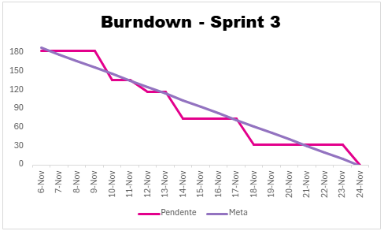

# ABP 1º Semestre DSM

# Documentação - Sprint 3

  <a href ="#desafio"> Desafio</a>  |
  <a href ="#us"> Backlog</a>  |   
  <a href ="#dor">DoR</a>  |
  <a href ="#dod">DoD</a>  |
  <a href ="#equipe"> Equipe</a> |
<a href ="#burndown"> Burndown</a>

> Status da Sprint: Finalizado ✅ 
>
> [Sprint 3 no YouTube] 📽️

##  Burndown Chart 📉🔥 

  

##  Modelo entidade relação banco de dados 

  

> Arquivo.xml para DB Design 4
>
> [Arquivo.xml](docs\entidade-relacao-AgriRSLab_NightHawks.xml) 

##  Desafio 

Finalizar o backend integrado ao dashboard, realizar o refinamento das páginas HTML com aplicação de estilos e concluir as versões em inglês. Entregar ao cliente o produto totalmente completo e funcional, atendendo a todos os requisitos funcionais e não funcionais.

##  Backlog e progresso 

  

    
<strong>🏷️ Legendas Tasks</strong>

    <ul>
      <li><strong>DD</strong> — Design Digital</li>
      <li><strong>DW</strong> — Desenvolvimento Web</li>
      <li><strong>ES</strong> — Engenharia de Software</li>
      <li><strong>AL</strong> — Algoritmos e Lógica de Programação</li>
      <li><strong>MB</strong> — Modelagem de Banco de Dados</li>
      <li><strong>SO</strong> — Sistemas Operacionais e Redes</li>
    </ul>
  

  

    
<strong>🏷️ Legendas Backlog ID</strong>

    <ul>
      <li><strong>RF</strong> — Requisito funcional</li>
      <li><strong>RNF</strong> — Requisito não funcional</li>
    </ul>
  

## ✅ Backlog do Projeto - Sprint 3 (Concluída)

| Backlog ID | Tipo do Item | Descrição | Prioridade | Pontuação | Sprint Designada | Prazo | Atribuídos |
| :---: | :---: | :--- | :---: | :---: | :---: | :---: | :--- |
| MB-003 | BANCO DE DADOS | CORREÇÃO DO CODIGO DO BANCO DE DADOS | Urgente | 5 | Sprint 3 | 06/11/25 | Victor |
| RNF02, AL-008 | BACKEND | FUNÇÃO DE EDITAR - MEMBROS | Alta | 8 | Sprint 3 | 18/11/25 | Gianluca |
| RNF02, AL-008, AL-009 | BACKEND | GET DE INFORMAÇÕES - PÁGINA DE MEMBROS | Alta | 5 | Sprint 3 | 18/11/25 | Gianluca |
| RNF02, AL-011 | BACKEND | FUNÇÃO DE UPLOAD DAS IMAGENS | Alta | 5 | Sprint 3 | 18/11/25 | Gianluca |
| RF01.4, DW-038 | FRONT-END | CRIAÇÃO DE UMA PÁGINA DE PARCEIROS | Muito alta | 5 | Sprint 3 | 10/11/25 | Guilherme, Lucas Cecon |
| RNF01, RF01.4, DW-045 | FRONT-END | CRIAÇÃO DA PÁGINA DE COLABORADORES - RESPONSIVA | Muito alta | 5 | Sprint 3 | 10/11/25 | Guilherme |
| RNF02, DW-047 | FRONT-END | CRIAÇÃO DO DASHBOARD - MEMBROS | Média | 8 | Sprint 3 | 14/11/25 | Gianluca, Victor |
| RNF02, DW-047 | FRONT-END | CRIAÇÃO DO DASHBOARD - ADMINISTRADOR | Média | 8 | Sprint 3 | 14/11/25 | Gianluca, Victor |
| RNF02, DW-052 | FRONT-END | CRIAÇÃO DA LISTA DE CONTEUDO | Média | 5 | Sprint 3 | 14/11/25 | Gianluca, Victor |
| RNF02, DW-051 | FRONT-END | CRIAÇÃO DA PÁGINA DE CRIAR CONTEUDO | Média | 5 | Sprint 3 | 14/11/25 | Gianluca, Victor |
| RNF02, DW-050 | FRONT-END | CRIAÇÃO DA LISTA DE MEMBROS | Média | 5 | Sprint 3 | 14/11/25 | Gianluca, Victor |
| RNF02, DW-048 | FRONT-END | CRIAÇÃO DA PÁGINA DE CADASTRAR MEMBROS | Média | 5 | Sprint 3 | 14/11/25 | Gianluca, Victor |
| RNF02, DW-046 | FRONT-END | CRIAÇÃO DE LOGIN | Média | 3 | Sprint 3 | 14/11/25 | Gianluca, Victor |
| RF05, DW-044 | FRONT-END | MELHORIA DA PÁGINA DE ÁREAS DE ATUAÇÃO | Média | 5 | Sprint 3 | 14/11/25 | Guilherme |
| RF03 | FRONT-END | MELHORIA DA PÁGINA DE MEMBROS | Média | 5 | Sprint 3 | 14/11/25 | Lucas Cecon |
| RF01, DW-041 | FRONT-END | MELHORIA DA PÁGINA BASE | Média | 5 | Sprint 3 | 18/11/25 | Victor |
| RNF02, DW-049 | FRONT-END | CRIAÇÃO DA PÁGINA DE EDIÇÃO DE PERFIL | Média | 5 | Sprint 3 | 18/11/25 | Gianluca |
| RF01, DW-041 | FRONT-END | MELHORIA E OTIMIZAÇÃO DA PÁGINA PADRÃO | Média | 5 | Sprint 3 | 18/11/25 | Victor |
| RF01, DW-039 | FRONT-END | MELHORIA DA PÁGINA HOME | Média | 5 | Sprint 3 | 18/11/25 | Lucas Cobra |
| RF02, DW-048 | FRONT-END | MELHORIA DA PÁGINA SOBRE | Média | 5 | Sprint 3 | 24/11/25 | Allan |
| RF06, DW-052 | FRONT-END | MELHORIA DA PÁGINA DE NOTÍCIAS | Média | 5 | Sprint 3 | 24/11/25 | Allan, Guilherme |
| RF05, DW-066 | FRONT-END | MELHORIA DA PÁGINA DE PROJETOS | Média | 5 | Sprint 3 | 24/11/25 | Lucas Cecon |
| RF07, DW-062, AL-014, DW-065 | FRONT-END/BACKEND | MELHORIA DA PÁGINA DE PUBLICAÇÕES | Média | 5 | Sprint 3 | 24/11/25 | Lucas Cecon |
| RF04, DW-064 | FRONT-END | MELHORIA DA PÁGINA DE VAGAS | Média | 3 | Sprint 3 | 24/11/25 | Allan |
| RF04, DW-054 | FRONT-END | MELHORIA DA PÁGINA DE VAGA INDIVIDUAL | Média | 5 | Sprint 3 | 24/11/25 | Allan |
| RNF02, AL-013 | BACKEND | Criação dos botões de compartilhar nas paginas que possuem conteudo | Média | 3 | Sprint 3 | 24/11/25 | Allan |
| RNF03, AL-016 | BACKEND | Refinamento do script de membros | Média | 3 | Sprint 3 | 24/11/25 | Allan |
| AL-017 | BACKEND | Paginação em telas com lista de conteúdo | Média | 3 | Sprint 3 | 24/11/25 | Lucas Cecon |
| RNF06, DW-066 | FRONT-END | Padronização em todas as páginas | Média | 3 | Sprint 3 | 24/11/25 | Lucas Cecon |
| RNF04, DW-075 | FRONT-END | CRIAÇÃO DA PÁGINA PUBLICAÇÕES - EN | Média | 3 | Sprint 3 | 24/11/25 | Allan |
| RNF04, AL-018 | BACKEND | Criação do modal informativo quando o site for traduzido para ingles | Média | 3 | Sprint 3 | 24/11/25 | Allan |
| RNF02, AL-019 | BACKEND | Criação do dinamismo de campos no formulário de criação de conteúdo | Média | 3 | Sprint 3 | 24/11/25 | Allan |
| RNF02, AL-020 | BACKEND | Refinamento do script de publicações | Média | 3 | Sprint 3 | 24/11/25 | Lucas Cecon |
| ES-012 | DOCUMENTAÇÃO | MANUAL DE USUÁRIO INTERNO | Baixa | 3 | Sprint 3 | 24/11/25 | Gianluca |
| ES-012 | DOCUMENTAÇÃO | MANUAL DE USUÁRIO EXTERNO | Baixa | 3 | Sprint 3 | 24/11/25 | Guilherme |
| ES-013 | DOCUMENTAÇÃO | MANUAL DE INSTALAÇÃO | Baixa | 3 | Sprint 3 | 24/11/25 | Gianluca |
| ES-013 | DOCUMENTAÇÃO | MANUAL DE CRIAÇÃO DO BD | Baixa | 3 | Sprint 3 | 24/11/25 | Gianluca |
| ES-010 | DOCUMENTAÇÃO | UML/CASOS DE USO | Baixa | 1 | Sprint 3 | 24/11/25 | Lucas Cecon |
| ES-011 | DOCUMENTAÇÃO | FINALIZAÇÃO DO GITHUB | Baixa | 1 | Sprint 3 | 24/11/25 | Guilherme |
| MB-004 | DOCUMENTAÇÃO | MODELO ENTIDADE RELACIONAL | Baixa | 5 | Sprint 3 | 24/11/25 | Victor |
| RNF06, AL-017 | FRONT-END | MELHORIA E PADRONIZAÇÃO DOS BOTÕES | Baixa | 5 | Sprint 3 | 24/11/25 | Lucas Cecon |
| RNF04, DW-069 | FRONT-END | CRIAÇÃO DA PÁGINA HOME - EN | Baixa | 1 | Sprint 3 | 24/11/25 | Guilherme |
| RNF04, DW-076 | FRONT-END | CRIAÇÃO DA PÁGINA SOBRE - EN | Baixa | 1 | Sprint 3 | 24/11/25 | Victor |
| RNF04, DW-070 | FRONT-END | CRIAÇÃO DA PÁGINA MEMBROS - EN | Baixa | 1 | Sprint 3 | 24/11/25 | Victor |
| RNF04, DW-074 | FRONT-END | CRIAÇÃO DA PÁGINA PROJETOS - EN | Baixa | 1 | Sprint 3 | 24/11/25 | Victor |
| RNF04 | FRONT-END | CRIAÇÃO DA PÁGINA ÁREAS DE ATUAÇÃO - EN | Baixa | 1 | Sprint 3 | 24/11/25 | Victor |
| RNF04, DW-073 | FRONT-END | CRIAÇÃO DA PÁGINA PARCEIROS - EN | Baixa | 1 | Sprint 3 | 24/11/25 | Victor |
| RNF04, DW-077, DW-078 | FRONT-END | CRIAÇÃO DA PÁGINA VAGAS - EN | Baixa | 1 | Sprint 3 | 24/11/25 | Victor |
| RNF04, DW-062 | FRONT-END | CRIAÇÃO DA PÁGINA FEED - EN | Baixa | 1 | Sprint 3 | 24/11/25 | Victor |
| RNF04, DW-071, DW-072 | FRONT-END | CRIAÇÃO DA PÁGINA NOTICIAS - EN | Baixa | 1 | Sprint 3 | 24/11/25 | Victor |
| RNF04, DW-068 | FRONT-END | CRIAÇÃO DA PÁGINA CONTATOS - EN | Baixa | 1 | Sprint 3 | 24/11/25 | Victor |

----------------------------------------------------

##  DoR - Definition of Ready 

|             Critério             | Descrição                                                                                                                                                           |
| :------------------------------: | ------------------------------------------------------------------------------------------------- |
|       Código Padronizado       | Segue boas práticas e padrões do time.           |
| Revisão e Deploy | Código revisado, aprovado e build sem erros. |

##  DoD - Definition of Done 

| Critério                                   | Descrição                                                                                     |
|--------------------------------------------|-------------------------------------------------------------------------------------------------|
| Integração do Backend com o Dashboard      | Backend totalmente implementado, testado e integrado ao dashboard.                             |
| Integração do Backend com as Páginas Home | Funcionalidades do backend conectadas às páginas iniciais, garantindo carregamento dinâmico e pleno funcionamento. |
| Refinamento das Páginas HTML               | Páginas revisadas, estilizadas e finalizadas, incluindo versões completas em inglês.            |
| Manual de Instalação e Manual do Usuário   | Documentações elaboradas e revisadas, orientando instalação, uso e navegação do sistema.        |
| Entrega do Produto Completo                | Sistema entregue 100% funcional, atendendo a todos os requisitos funcionais e não funcionais. |

## 🎓 Equipe 

  <table>
    <tr>
      <th>Membro</th>
      <th>Função</th>
      <th>Github</th>
      <th>Linkedin</th>
    </tr>
    <tr>
       <td>Gianluca Lourenço</td>
      <td>Product Owner</td>
      <td></td>
      <td></td>
    </tr>
    <tr>
      <td>Victor Coutinho</td>
      <td>Scrum Master</td>
      <td></td>
      <td></td>
    </tr>
    <tr>
      <td>Allan Ramos</td>
      <td>Desenvolvedor</td>
      <td></td>
      <td></td>
    </tr>
    <tr>
      <td>Guilherme Henrique</td>
      <td>Desenvolvedor</td>
      <td></td>
      <td></td>
    </tr>
    <tr>
      <td>Lucas Cecon</td>
      <td>Desenvolvedor</td>
      <td></td>
      <td></td>
    </tr>
    <tr>
      <td>Lucas Cobra</td>
      <td>Desenvolvedor</td>
      <td></td>
      <td></td>
    </tr>
  </table>

